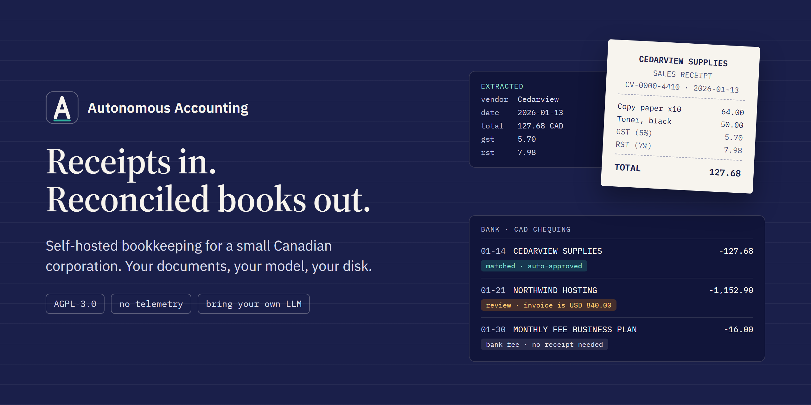
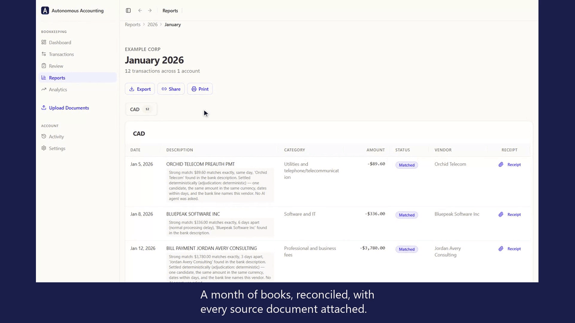
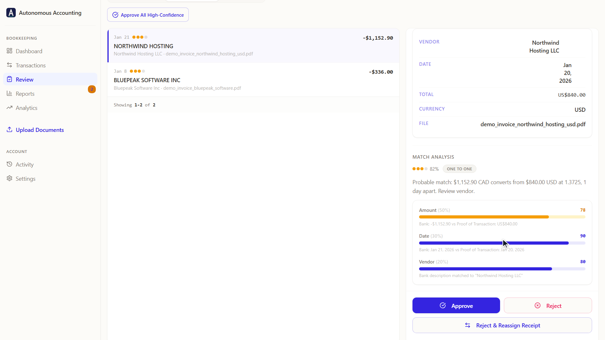
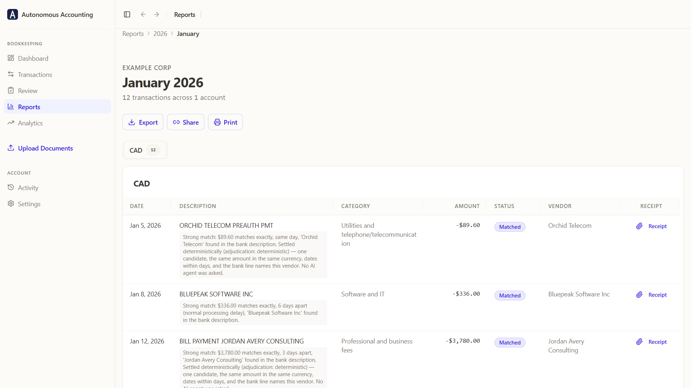
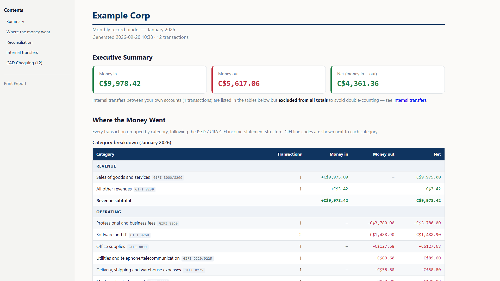
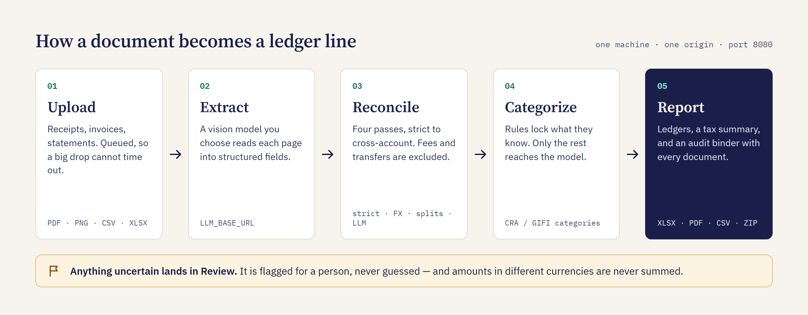

<p align="center">
  
</p>

<p align="center">
  
  
  
  
  
  
</p>

<p align="center">
  <b><a href="#see-it-work">Watch the demo</a> &nbsp;·&nbsp; <a href="#quickstart">Quickstart</a> &nbsp;·&nbsp; <a href="#how-it-works">How it works</a> &nbsp;·&nbsp; <a href="docs/data-schema.md">Your data</a> &nbsp;·&nbsp; <a href="#go-deeper">Known issues</a></b>
</p>

**Autonomous Accounting turns a pile of receipts, invoices and bank statements into a
reconciled, categorized ledger** — plus an audit binder with every source document
attached. A vision LLM you choose reads the documents, a four-pass matcher pairs them with
your bank lines, and anything it is not sure of is flagged for you instead of guessed.
Everything runs on one machine you own: no account to create, no vendor to pay, no copy of
your books anywhere but your own disk.

## See it work

One invented company's January in a little over a minute: eight documents and a bank CSV go in,
a reconciled ledger and a downloadable audit binder come out. Every frame is the real app driven
by a script; the two stretches that wait on the model are sped up and say so on screen.

<p align="center">
  
</p>

<sub>In order: the inputs → the statement parses → extraction → **Match Receipts** → the two
pairs that needed a person, approved in **Review** → the ledger's export menu → the audit
binder. Everything shown is synthetic. `python scripts/gen_demo_data.py` writes the same month
on your machine — see [Try the demo month](#try-the-demo-month).</sub>

## What you get

|  |  |  |
|---|---|---|
| **A review queue, not a black box.** Exact pairs approve themselves; date gaps and cross-currency pairs wait for you. | **A ledger with CRA/GIFI categories.** Monthly and annual, with a GST/HST/PST summary and QuickBooks- and Xero-style CSVs. | **An audit binder in one ZIP.** The XLSX workbook, a self-contained HTML report, and the document behind every line. |

## How it works

<p align="center">
  
</p>

- **Extraction.** Receipts, invoices and PDF bank statements are rasterised and read by a
  vision LLM into structured JSON (vendor, date, amount, tax, currency), with totals
  cross-checked against line items. Uploads queue and answer `202`; a background worker
  drains the queue, so dropping half a year of documents at once cannot time out, and a
  restart re-queues whatever was mid-flight.
- **Reconciliation.** Four passes over the unmatched set: strict same-currency, FX-relaxed
  inside a configurable band, an aggressive pass for splits and installments, and an LLM
  pass that links across accounts.
- **Categorization.** A deterministic regex pre-pass (`config/category_rules.yaml`) locks
  what it recognises, vendor clustering normalises descriptors, and only the remainder
  reaches the model, under a per-run call budget.
- **Reports.** Monthly and annual ledgers, a GST/HST/PST tax summary, a PDF report,
  QuickBooks- and Xero-style CSVs, a shareable read-only link, the ZIP audit binder — and an
  optional "reasonableness" pass that compares your expense ratios against published
  Canadian industry data.

## Rules it does not break

- **It flags; it does not guess.** A wrong number in a tax filing is worse than a blank.
  Bank fees, interest and internal transfers are excluded rather than force-matched.
- **It never sums across currencies.** A USD invoice paid in CAD is an FX match for review,
  never an "exact" one.
- **Your documents go only where you point them.** Set `LLM_BASE_URL` to a server on your own
  machine or LAN and nothing leaves. An empty provider key means *off*; nothing silently
  falls back to a paid provider, and `GET /health` shows where an upload would go. If the
  endpoint is unreachable, jobs park in `waiting_for_model` and resume by themselves.
- **No telemetry, no analytics, no webfonts.** Loading a page fetches nothing from anyone
  else. The log files on your disk are the only record.
- **Row-level security on every table**, keyed on the signed-in user and enforced from the
  catalogue by a test.

The long form — backups, encryption at rest, what reaches a model — is in
[Honesty about data](docs/data-handling.md).

## Quickstart

You need **Python 3.11+**, **Node 20+**, **PostgreSQL 15+** on loopback, and any
OpenAI-compatible, vision-capable endpoint — vLLM, llama.cpp, Ollama's `/v1`, LM Studio.
This project hosts no model of its own.

```bash
python -m venv .venv && . .venv/bin/activate    # Windows: .venv\Scripts\activate
pip install -r requirements.txt
cp .env.example .env                            # then fill in the three values it names

createdb autonomous_accounting                  # the order below is not interchangeable
psql -d autonomous_accounting -f db/local_auth_schema.sql
psql -d autonomous_accounting -f db/schema_pg.sql
python -m db.migrate
psql -d autonomous_accounting -f db/local_grants.sql

npm --prefix web ci && npm --prefix web run build
python -m uvicorn server.app:app --port 8080    # then open http://localhost:8080
```

Registration is closed by default. Set `AUTH_ALLOW_SIGNUP=1`, restart, sign up, then set it
back to `0`. `GET /health` reports database, storage and LLM reachability.

<details>
<summary><b>The three <code>.env</code> values, and how to generate the secrets</b></summary>

Generate each secret exactly as `.env.example` says:

```bash
python -c "import secrets;print(secrets.token_urlsafe(48))"   # AUTH_JWT_SECRET
python -c "import secrets;print(secrets.token_urlsafe(48))"   # STORAGE_URL_SECRET
```

and set `DATABASE_URL` to the database you are about to create. Every other variable, with
its default, is in `.env.example`. `AUTH_AUTOCONFIRM=1` (the default) means a new account
works immediately without any mail transport.

</details>

<details>
<summary><b>Why the schema files run in that order</b></summary>

`local_auth_schema.sql` must run first: it creates the `auth` schema, `auth.uid()` and the
`authenticated` role, all of which `schema_pg.sql` needs. `schema_pg.sql` is the whole
schema — every table, index, trigger and row-level-security policy — as a single baseline;
`db/migrations/` ships empty and `python -m db.migrate` therefore has nothing to do on a
fresh install, but run it anyway so anything added after the baseline is picked up.
`local_grants.sql` must run last: it grants on the tables the steps above created, and
without it every query fails with *permission denied*. Each step is idempotent, so
re-running the sequence on an existing database changes nothing. (Nothing in `db/` needs a
server feature newer than PostgreSQL 13; 15 is just the oldest release still maintained
upstream.)

</details>

<details>
<summary><b>Developing the frontend with the Vite dev server</b></summary>

FastAPI serves the built bundle from the same origin. For frontend work, run the Vite dev
server instead, which proxies `/api` to the backend:

```bash
cd web
npm ci
npm run dev            # http://localhost:5174
```

</details>

<details>
<summary><b>Peer-benchmark data (optional, one command)</b></summary>

The reasonableness engine needs a benchmark table, which is **not** committed:

```bash
python scripts/ingest_ised_benchmarks.py --year 2024 --out config/ised_benchmarks.json
```

That downloads the Financial Performance Data CSVs published by Innovation, Science and
Economic Development Canada on the Government of Canada Open Government Portal, normalises
them into per-industry cohort cells, validates them fail-loud, and writes a large JSON file
that `.gitignore` excludes. The data is licensed under the **Open Government Licence –
Canada**; the generated file and every report built from it carry the attribution the
licence requires. No Open Government Licence data file is distributed with this repository
— you build the table yourself. See `NOTICE`.

Every run validates structure and plausibility. `--anchor anchor.json` adds an optional
check that one named cell still carries the figures you expect, so a refresh that quietly
changes what a cell means aborts instead of overwriting your table; with no anchor
supplied, no cell-specific figures are demanded.

`--seed-only` writes a small table of invented example figures instead, with no download —
enough for the engine and its tests to run, and labelled in its own `meta` as not being
industry data. Skip the step entirely and the feature stays off; nothing else is affected.

</details>

## Try the demo month

The files under `tests/fixtures/` are per-parser unit fixtures; uploaded through the UI they
match nothing, because no receipt among them belongs to any bank line. To see the whole
pipeline work, generate a coherent synthetic month instead:

```bash
python scripts/gen_demo_data.py          # writes data/demo/, which is gitignored
```

That writes one invented company's January 2026 — a 12-row CAD statement in the built-in
CSV layout, seven PDFs and one PNG — plus a `README.txt` saying what each file is there to
show. Then, in the app:

1. Set `OWN_COMPANY_PATTERNS=example corp` in `.env` and restart, so the invoice *issued
   by* the demo company is read as income and can match the incoming wire.
2. Sign up, choose **Manitoba** as the province (the demo documents charge GST and RST),
   and upload `demo_bank_cad.csv` as the statement.
3. Upload all eight documents at once. They queue; each takes roughly a minute on a
   27B-class local vision model, less on a hosted one.
4. Press **Match Receipts**. Expect exact same-day pairs to be auto-approved without a
   model call, a six-day date gap and a USD invoice paid in CAD to land in **Review**, the
   monthly fee, interest and inter-account transfer to be marked as needing no receipt,
   two bank lines left asking for a document, and a cash receipt left unmatched.
5. Approve the pending pairs in **Review**, then download the audit binder from
   **Reports → January 2026** and open `proof_of_transaction/` and `index.html`.

What that run looks like on one model is written up under *Verification gaps* in
`docs/backlog.md`, next to the defects it found.

## What it is not

- **Not a hosted service.** Nothing to sign up for. You run it or it does not run.
- **Not something you buy.** The software takes no payment. Every signed-in account has
  full access to every feature.
- **Not supported.** No warranty, no SLA, no security response commitment, no promise that
  an upgrade will not want a manual migration. See the licence.
- **Not a filing service.** It produces a ledger and reports for a Canadian small
  corporation, and models GST/HST/PST only. It files nothing with the CRA and it is not
  accounting advice. Check the numbers before you use them.

## Architecture

| Layer | What runs |
|---|---|
| API + web app | FastAPI on uvicorn, port `8080` by default; serves `/api/*` and the built SPA from one origin |
| Database | PostgreSQL with row-level security keyed on the signed-in user |
| File storage | A directory on local disk, served only through short-lived HMAC-signed URLs |
| Frontend | React 19 + Vite + TypeScript, Tailwind, TanStack Query, Zustand |
| Extraction | Any **OpenAI-compatible, vision-capable** endpoint you point `LLM_BASE_URL` at. Gemini and OpenAI are optional fallbacks that stay inert while their keys are empty |
| Auth | Local email + password (`server/local_auth.py`): HS256 access tokens, rotating refresh tokens, PBKDF2-HMAC-SHA256 hashes. Sign in with Google is optional |

## Go deeper

| | |
|---|---|
| [**Bring your own data**](docs/data-schema.md) | The six YAML tables under `config/` you are expected to edit, every record shape and status vocabulary, the built-in bank parsers (BMO, Wise, PayPal, Amazon; everything else goes through the LLM statement parser), and the minimum CSV a hand-made statement needs |
| [**Honesty about data**](docs/data-handling.md) | Where everything sits, what is and is not encrypted, backups, what reaches a model |
| [**Known issues**](docs/backlog.md) | Open engineering items. Read *Security hardening* before exposing an instance beyond loopback: the defaults — one owner, loopback only, registration closed — are what this was reviewed for |
| [**Testing**](docs/testing.md) | `./scripts/gates.sh` runs ruff, pytest, typecheck and build — there is no CI. How `pytest` isolates its database, and what the synthetic fixtures do not prove |
| [**Working on it with a coding agent**](.claude/README.md) | `CLAUDE.md` and `AGENTS.md` are the entry points; `.claude/` is an optional Claude Code harness that denies agent reads of `.env`, `data/` and `logs/`. Nothing in the application depends on it |

One thing a stranger will meet early: **Gmail's OAuth redirect has to match what you
registered.** The code builds `<BASE_URL>/api/onboarding/gmail/callback`, and `BASE_URL`
defaults to `http://localhost:8080`. If you serve the app anywhere else, set `BASE_URL` (or
`GMAIL_REDIRECT_URI`) before connecting Gmail, and register the same value with Google.
Gmail, PayPal and Wise gather integrations stay hidden until you configure credentials.

## Contributing

See [CONTRIBUTING.md](CONTRIBUTING.md): synthetic fixtures only, `ruff` and `tsc` clean, one
topic per pull request, sign off your commits (`git commit -s`). The most useful
contribution is a statement parser or a category rule for a layout the engine does not read
yet — built from invented data, never real books.

If this saved you a bookkeeping afternoon, a star helps the next small-business owner find it.

## Licence

Autonomous Accounting — self-hosted bookkeeping with LLM document extraction and bank
reconciliation. Copyright (C) 2026 Autonomous Accounting contributors

This program is free software: you can redistribute it and/or modify it under the terms
of the GNU Affero General Public License as published by the Free Software Foundation,
either version 3 of the License, or (at your option) any later version.

This program is distributed in the hope that it will be useful, but WITHOUT ANY
WARRANTY; without even the implied warranty of MERCHANTABILITY or FITNESS FOR A
PARTICULAR PURPOSE. See the GNU Affero General Public License for more details.

You should have received a copy of the GNU Affero General Public License along with this
program. If not, see <https://www.gnu.org/licenses/>.

Full text in [LICENSE](LICENSE). Because this is the AGPL, running a modified version as
a network service obliges you to offer its source to its users. Third-party attributions
— including PyMuPDF, itself AGPL — are in [NOTICE](NOTICE).
